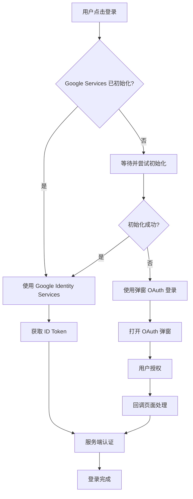

# Google 登录功能改进说明

## 概述

本次更新完善了 Google 登录功能，解决了在页面刚加载时 Google Identity Services 可能未完全初始化的问题。现在系统会自动检测初始化状态，并在需要时使用备用的弹窗登录方案，确保用户始终能够成功登录。

## 主要改进

### 1. 智能初始化检测

- 新增 `isGoogleServicesInitialized()` 函数，实时检测 Google Identity Services 的初始化状态
- 自动判断是否需要使用备用登录方案

### 2. 智能初始化等待机制

- 当 Google Identity Services 未完成初始化时，系统会自动等待并尝试初始化
- 初始化完成后自动触发登录逻辑，无需用户重新点击
- 提升用户体验，避免显示"未初始化"的错误提示

### 3. 备用弹窗登录

- 新增 `signInWithGooglePopup()` 函数，使用标准 OAuth 2.0 流程
- 当初始化等待失败时自动启用备用方案
- 支持弹窗窗口登录，确保登录功能始终可用

### 4. 统一的登录入口

- 更新 `signInWithGoogle()` 函数，现在会自动处理初始化等待和选择最佳的登录方式
- 优先尝试初始化 Google Identity Services，然后使用该服务进行登录
- 初始化失败时自动切换到弹窗方式，对调用者完全透明

### 5. 改进的按钮渲染

- 更新 `renderGoogleSignInButton()` 函数
- 当 Google 服务未初始化时，自动渲染备用按钮
- 备用按钮样式与官方按钮保持一致

### 5. 错误处理优化

- 移除了登录表单中不必要的预检查
- 现在显示具体的错误信息，帮助用户了解问题
- 更好的用户反馈机制

## 技术实现

### 登录流程



### 关键文件

1. **`lib/google-auth.ts`** - 核心认证逻辑
   - `isGoogleServicesInitialized()` - 检测初始化状态
   - `signInWithGooglePopup()` - 备用弹窗登录
   - `signInWithGoogle()` - 统一登录入口
   - `renderGoogleSignInButton()` - 智能按钮渲染

2. **`app/auth/google/callback/page.tsx`** - OAuth 回调页面
   - 处理弹窗登录的回调
   - 解析 URL 参数并发送消息给父窗口

3. **`components/login-form.tsx`** - 登录表单
   - 简化了 Google 登录逻辑
   - 移除了不必要的预检查

4. **`components/signup-form.tsx`** - 注册表单
   - 同样简化了 Google 登录逻辑
   - 支持邀请码功能

## 使用方法

### 基本登录

```typescript
import { signInWithGoogle } from '@/lib/google-auth';

try {
  const result = await signInWithGoogle();
  console.log('登录成功:', result.user);
} catch (error) {
  console.error('登录失败:', error.message);
}
```

### 带邀请码的注册

```typescript
import { signInWithGoogle } from '@/lib/google-auth';

try {
  const result = await signInWithGoogle('invitation-code-123');
  console.log('注册成功:', result.user);
} catch (error) {
  console.error('注册失败:', error.message);
}
```

### 渲染登录按钮

```typescript
import { renderGoogleSignInButton } from '@/lib/google-auth';

const buttonElement = document.getElementById('google-signin-button');
renderGoogleSignInButton(buttonElement, null, {
  theme: 'outline',
  size: 'large',
  text: 'signin_with'
});

// 监听登录事件
window.addEventListener('googleSignInSuccess', (event) => {
  console.log('登录成功:', event.detail);
});

window.addEventListener('googleSignInError', (event) => {
  console.error('登录失败:', event.detail.error);
});
```

## 兼容性

- 完全向后兼容，现有代码无需修改
- 支持所有现代浏览器
- 自动处理弹窗阻止器的情况
- 支持移动端浏览器

## 安全性

- 使用标准 OAuth 2.0 流程
- 所有通信都通过 HTTPS
- 严格的 Origin 验证
- 自动处理 CSRF 保护

## 故障排除

### 常见问题

1. **弹窗被阻止**
   - 错误信息："Failed to open popup window. Please allow popups for this site."
   - 解决方案：提示用户允许弹窗，或使用按钮方式登录

2. **网络连接问题**
   - 错误信息："Network connection error, please check your network and try again"
   - 解决方案：检查网络连接，重试登录

3. **服务端认证失败**
   - 错误信息：具体的服务端错误信息
   - 解决方案：检查服务端配置和 API 状态

### 调试模式

在开发环境中，可以通过浏览器控制台查看详细的登录流程日志：

```javascript
// 启用调试模式
localStorage.setItem('google-auth-debug', 'true');
```

## 更新日志

### v2.0.0 (当前版本)

- ✅ 新增智能初始化检测
- ✅ 新增备用弹窗登录方案
- ✅ 优化错误处理和用户反馈
- ✅ 改进按钮渲染逻辑
- ✅ 简化组件集成代码
- ✅ 完善文档和示例

### v1.0.0 (之前版本)

- 基础 Google Identity Services 集成
- 基本的登录和注册功能
- 服务端 API 认证